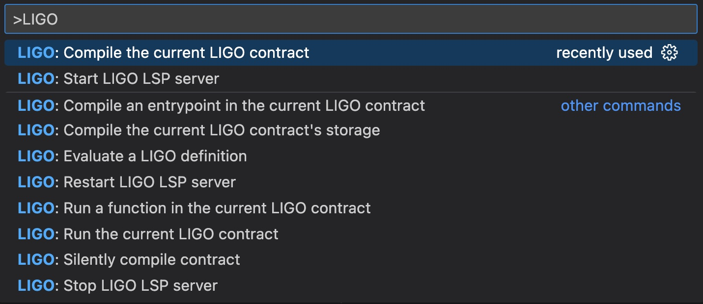

# "my first Tezos smart contract - LIGO s"

 *Note that this tuturial is still incomplete and on hold while LIGO is preparing for some major updates and updating their documentation ("V1"). I'll pick it up again when these changes are made.*

This short tutorial shows how to install the development tools and run a minimal Tezos smart contract with LIGO. You need a Mac (tested on an Intel MacBook Pro 2018, macOS Monterey) and some patience during the installation steps.

- Start from scratch, no previous knowledge necessary 
- Learn to develop a minimal Tezos smart contract 
- Write code in CameLIGO (https://www.ligolang.org/)
- Run the smart contract on a testnet (copy of the actual blockchain, no risk of value loss)

For a curated overview of Tezos developer resources see https://github.com/crcdng/tezos-dev-resources

## i. Install

### Install general development tools 

1. Download and install the [Visual Studio Code code editor](https://code.visualstudio.com/)

2. Install the [Homebrew](https://brew.sh/) tooling environment: open a Terminal (press command-Spacebar and type "terminal"), then execute this command in the Terminal 

`/bin/bash -c "$(curl -fsSL https://raw.githubusercontent.com/Homebrew/install/HEAD/install.sh)"`

If you do not already have Apple's XCode installed, make sure that you confirm when the installations prompts you with "The XCode Command Line Tools will be installed." Alternatively, you can also get XCode from the Apple App Store. 

### Install LIGO specific development tools 

3. Install the Tezos client with Homebrew

In the Terminal, execute this command: 

`brew tap serokell/tezos-packaging-stable https://github.com/serokell/tezos-packaging-stable.git`

then:

`brew install tezos-client`

(source: https://github.com/serokell/tezos-packaging/blob/master/docs/distros/macos.md)

4. Install LIGO with Homebrew

In the Terminal, execute this command 

`brew tap ligolang/ligo https://gitlab.com/ligolang/ligo.git`

followed by

`brew install ligolang/ligo/ligo`

(source: https://www.ligolang.org/docs/intro/installation/?lang=cameligo)

Close and re-open the Terminal. 

Note: LIGO is getting regular updates that are announced [on their website](https://ligolang.org/). To get the latest version, run these two commands in Terminal:   

`brew update`

followed by 

`brew upgrade`

5. In Visual Studio Code, install the [ligolang-vscode extension](https://marketplace.visualstudio.com/items?itemName=ligolang-publish.ligo-vscode) 

...this concludes the installation. Now you are ready to code.

## ii. Code  

Download and unzip this repository (or clone it if you are familiar with git) and open the folder in Visual Studio Code. To do this, either drag and drop the folder on an open Visual Studio Code window, or on its icon in the Dock. Alternatively, select `File` -> `Open Folder...` from the menu and navigate to the folder. 

Open the file [my_first_contract.mligo](my_first_contract.mligo). This is a minimal smart contract, adapted from https://www.ligolang.org/?lang=cameligo. It looks like this: 

```ligo
type storage = int

type parameter =
  Increment of int
| Decrement of int
| Reset

let add (store, delta : storage * int) = store + delta
let sub (store, delta : storage * int) = store - delta

let main (action, store : parameter * storage) : operation list * storage =
 [],   
 (match action with
   Increment (n) -> add (store, n)
 | Decrement (n) -> sub (store, n)
 | Reset         -> 0)
```

The smart contract shown here is for learning - all it does is adding and subtracting numbers. However, its basic structure is useful to understand any contract.

In the first part it defines three types, followed by three functions. The `main` function is the entrypoint of the smart contract. It receives parameters that describe three possible actions of the smart contract and returns an empty list of operations and the updated storage. The three actions are: add a value to the current value (storage), subtract a value from the storage and reset the storage to 0.

Type definitions and functions are the major building blocks for smart contracts. You can learn more about this, the LIGO syntax and more elaborate smart contracts in the [documentation](https://www.ligolang.org/docs/intro/introduction?lang=cameligo). 

For this tutorial we use the above code to show the next steps - compile it, deploy it to the testnet and then call the smart contract on the blockchain.

## iii. Compile and Test

### Compile the code 
 
Visual Studio Code has a menu for running commands: the Command Palette. With the code in `my_first_contract.mligo` open, select `View` -> `Command Palette` (or press SHIFT-CMD-P) and type `LIGO`. This provides a list of commands like this one: 



Select `LIGO: Compile the current LIGO contract`. Confirm the prompt that sets the `main` function as the entrypoint. In the Output section of Visual Studio Code, you should see: 

```
{ parameter (or (or (int %decrement) (int %increment)) (unit %reset)) ;
  storage int ;
  code { UNPAIR ;
         IF_LEFT { IF_LEFT { SWAP ; SUB } { ADD } } { DROP 2 ; PUSH int 0 } ;
         NIL operation ;
         PAIR } }
```

What does 'compile' do? It transforms code written in a higher level programming language, one that is meant for humans (here: CameLIGO) into a lower level language that is meant to run on the blockchain (here: Michelson). In general, we write the code in CameLIGO, compile it to Michelson and then send the Michelson code to the Tezos blockchain. Note that you do not need to learn Michelson, but if you want you [can dive into it here](https://tezos.gitlab.io/active/michelson.html).

While the Command Palette in VSCode is useful for quick testing, there is a second way to run LIGO commands: the command line interface (CLI). To use the CLI, open a Terminal window inside VSCode `Terminal -> New Terminal`. This is similar to the Terminal we used above.

Then enter this line into the Terminal window:

`ligo compile contract my_first_contract.mligo -o my_first_contract.tz`

This writes a file called `my_first_contract.tz`. Look into that file: it contains the compiled contract, the same output as above.

### Test the code 

Now you can also test out what the code does ("dry run"). Remember, we want to add two numbers and store the result. To set the initial value to 10 and add 32 to that value, enter this line into the Terminal window:

`ligo run dry-run my_first_contract.mligo "Increment(32)" "10"`

The output is:

`( LIST_EMPTY() , 42 )`

This is the result of calling the smart contract: an empty list of operations (a more advanced topic, addressed in a future tutorial) and the 42 which is now the value of the updated storage.

In a real project you would test the functions of the smart contract more thoroughly and also test the Michelson code on a local, simulated blockchain. These steps are described [here](https://ligolang.org/docs/tutorials/getting-started?lang=cameligo#test-the-code-with-ligo-test-framework) and [here](https://ligolang.org/docs/tutorials/getting-started?lang=cameligo#testing-the-michelson-contract). 

We will go on and deploy our contract on a public blockchain that is made for testing - the Ghostnet.

## iv. Deploy 

**WORK IN PROGRESS** 

---

This repository is part of an onging effort to support Tezos developers and encourage artists who want to learn about creative (blockchain) coding. This effort started and was supported during [hicathon](https://hicathon.xyz/). Published under the Creative Commons Attribution 4.0 International License (CC BY 4.0).
